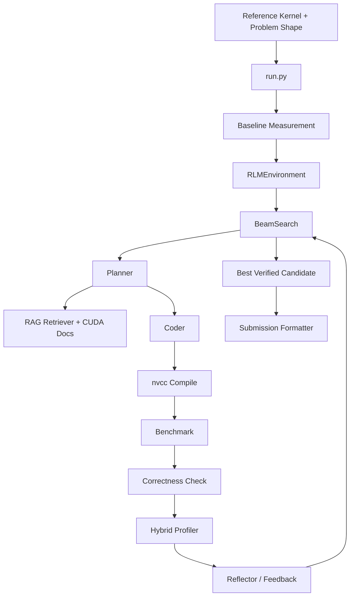

# KernelPilot

Author: Dev Desai

KernelPilot is an autonomous CUDA kernel optimization system built to answer a hard systems question:

Can an LLM-driven search stack take a real reference kernel, reason about GPU bottlenecks, synthesize better CUDA, validate correctness, and beat a production baseline without human-written kernel-specific optimization plans?

This repository is my answer to that question.

It combines multi-agent planning, profiler-guided refinement, retrieval-augmented CUDA knowledge, benchmark discipline, and correctness gating into a single end-to-end optimization pipeline for Blackwell-class NVFP4 workloads.

## Executive Summary

KernelPilot is not a prompt wrapper around `nvcc`. It is a research-style optimization engine with five tightly integrated pieces:

- a planner that forms optimization hypotheses from source code, runtime signals, and retrieved CUDA patterns
- a coder that turns those hypotheses into compilable CUDA kernels
- a search loop that explores, ranks, prunes, and refines branches
- a measurement layer that checks correctness and times candidates against a strong baseline
- a feedback loop that uses profiler evidence instead of generic “optimize this kernel” advice

The target workloads are:

- fused `add_rmsnorm` with NVFP4 quantization
- `nvfp4_quantize` block quantization
- fused `silu_mul` with NVFP4 quantization

The reported repository results show up to `1.845x` speedup over the production baseline on NVIDIA B200, with an approximate geometric mean of `1.61x` across the benchmarked kernels.

## Research Hypothesis

My working hypothesis for this project is:

An autonomous optimization loop can outperform strong baseline CUDA kernels if it is given four things at once:

1. real runtime evidence instead of static code-only reasoning
2. search diversity instead of single-shot generation
3. correctness and anti-hack filters as hard gates
4. external retrieval over high-quality CUDA sources so the model is not reasoning in a vacuum

This repository operationalizes that hypothesis. Every major subsystem exists to make one part of that claim testable.

## Why This Project Is Hard

Autonomous kernel optimization is difficult for reasons that compound:

- CUDA kernels are tightly coupled to hardware behavior, occupancy, register pressure, memory traffic, and launch geometry
- small source changes can produce large performance cliffs
- generated kernels often compile but are numerically wrong
- benchmark numbers are easy to inflate with unfair baselines or mismatched timing paths
- LLMs are prone to generic advice, hallucinated intrinsics, and unstable code revisions if the loop is under-constrained

KernelPilot addresses those issues with disciplined structure:

- official-baseline-first evaluation
- branch-based search instead of one-shot sampling
- seeded correctness checks
- runtime and profiler feedback
- RAG over real CUDA sources
- explicit retirement of stagnant candidate families

## Architecture

### System View



### Search Loop


### Core Idea

The architecture is deliberately modular:

- `rlm/` owns reasoning, prompts, environment state, planning, and feedback synthesis
- `search/` owns branching, diversity, ranking, and search progression
- `profiler/` owns bottleneck evidence and hybrid performance analysis
- `eval/` owns fairness, timing, correctness, and submission formatting
- `kernels/` provides the baseline kernels and shared CUDA support headers

That separation matters because it makes the system inspectable. A hiring manager or reviewer can look at each layer independently and understand how decisions are made.

## Results

The repository’s benchmark history reports the following results on NVIDIA B200 against FlashInfer production baselines:

| Kernel | Shape | Speedup |
| --- | --- | --- |
| `add_rmsnorm_fp4quant` | `128 x 2048` | `1.691x` |
| `add_rmsnorm_fp4quant` | `128 x 4096` | `1.650x` |
| `add_rmsnorm_fp4quant` | `128 x 8192` | `1.420x` |
| `nvfp4_quantize` | `128 x 14336` | `1.845x` |
| `silu_mul_fp4quant` | `8 x 256 x 7168` | `1.450x` |

Approximate geometric mean: `1.61x`

These numbers matter for two reasons:

- the comparison target is not a toy baseline; it is a production-oriented FlashInfer reference path
- the system is solving multiple kernel families rather than one hand-tuned benchmark

## What The System Actually Discovers

KernelPilot is intended to discover patterns such as:

- vectorized loads and stores
- hardware FP4 intrinsic usage on Blackwell
- better thread utilization when work mapping leaves idle lanes
- register caching to avoid repeated global reads
- launch-bound and occupancy-aware refinements
- dataflow simplifications that reduce unnecessary passes

The point is not that every candidate will discover every pattern. The point is that the system is structured so those patterns can emerge from runtime-grounded search instead of being hardcoded into a kernel-specific script.

## Benchmark Discipline

Performance claims are only interesting if the measurement path is credible.

KernelPilot takes that seriously:

- it attempts to use an official FlashInfer baseline first
- it marks fallback reference baselines as unofficial
- it reuses a consistent timing path between baseline and candidate
- it validates correctness before accepting a kernel as a win
- it records profiler and compiler evidence for follow-up reasoning

Important configured evaluation thresholds:

- absolute tolerance: `1e-2`
- relative tolerance: `1e-3`
- correctness seeds: `42`, `123`, `999`
- benchmark warmup iterations: `500`
- benchmark iterations: `100`

This is one of the strongest parts of the project from a systems-engineering perspective: the code does not treat “compiled once” as success.

## The Optimization Pipeline

At the top level, [run.py](/Users/DEVDESAI1/Desktop/University_at_Buffalo/Projects/KernelPilot/run.py) defines six task variants:

- `add_rmsnorm_fp4quant_b128xh2048`
- `add_rmsnorm_fp4quant_b128xh4096`
- `add_rmsnorm_fp4quant_b128xh8192`
- `nvfp4_quantize_m128xk14336`
- `silu_mul_fp4quant_b8xm256xk7168`
- `silu_mul_fp4quant_b8xm256xk14336`

For each task, the runtime flow is:

1. load configuration and environment variables
2. resolve the kernel source and shape
3. measure a baseline
4. create an `RLMEnvironment`
5. run `BeamSearch`
6. validate the best candidate with correctness checks
7. benchmark the final candidate
8. format and save the output submission

## Repository Breakdown

### `rlm/`

This is the reasoning core of the project.

- [rlm/engine.py](/Users/DEVDESAI1/Desktop/University_at_Buffalo/Projects/KernelPilot/rlm/engine.py): orchestration, decomposition, prompt building, multi-turn refinement, and tool routing
- [rlm/planner.py](/Users/DEVDESAI1/Desktop/University_at_Buffalo/Projects/KernelPilot/rlm/planner.py): branch planning and direction setting
- [rlm/planner_spec.py](/Users/DEVDESAI1/Desktop/University_at_Buffalo/Projects/KernelPilot/rlm/planner_spec.py): structured planning schema and instruction shaping
- [rlm/coder.py](/Users/DEVDESAI1/Desktop/University_at_Buffalo/Projects/KernelPilot/rlm/coder.py): code-generation prompt construction
- [rlm/fixer.py](/Users/DEVDESAI1/Desktop/University_at_Buffalo/Projects/KernelPilot/rlm/fixer.py): repair prompts for failed candidates
- [rlm/reflector.py](/Users/DEVDESAI1/Desktop/University_at_Buffalo/Projects/KernelPilot/rlm/reflector.py): converts measured outcomes into refinement guidance
- [rlm/feedback.py](/Users/DEVDESAI1/Desktop/University_at_Buffalo/Projects/KernelPilot/rlm/feedback.py): runtime-grounded targeted feedback
- [rlm/environment.py](/Users/DEVDESAI1/Desktop/University_at_Buffalo/Projects/KernelPilot/rlm/environment.py): per-run state, counters, metrics, branch memory, and config handling

### `search/`

This is the search-control layer.

- [search/beam_search.py](/Users/DEVDESAI1/Desktop/University_at_Buffalo/Projects/KernelPilot/search/beam_search.py): branch exploration, candidate timing, pruning, early stopping, and search progression
- [search/diversity_selector.py](/Users/DEVDESAI1/Desktop/University_at_Buffalo/Projects/KernelPilot/search/diversity_selector.py): preserves strategy diversity across candidates
- [search/combiner.py](/Users/DEVDESAI1/Desktop/University_at_Buffalo/Projects/KernelPilot/search/combiner.py): combines strong candidates into merged variants
- [search/strategy_bank.py](/Users/DEVDESAI1/Desktop/University_at_Buffalo/Projects/KernelPilot/search/strategy_bank.py): strategy catalog for CUDA optimization ideas

### `profiler/`

This is the evidence layer.

- [profiler/kernel_profiler.py](/Users/DEVDESAI1/Desktop/University_at_Buffalo/Projects/KernelPilot/profiler/kernel_profiler.py): compile-and-profile orchestration
- [profiler/hybrid_profiler.py](/Users/DEVDESAI1/Desktop/University_at_Buffalo/Projects/KernelPilot/profiler/hybrid_profiler.py): hybrid bottleneck analysis
- [profiler/roofline.py](/Users/DEVDESAI1/Desktop/University_at_Buffalo/Projects/KernelPilot/profiler/roofline.py): roofline model support for B200
- [profiler/metrics.py](/Users/DEVDESAI1/Desktop/University_at_Buffalo/Projects/KernelPilot/profiler/metrics.py): metric schema

### `eval/`

This is the fairness and safety layer.

- [eval/benchmark.py](/Users/DEVDESAI1/Desktop/University_at_Buffalo/Projects/KernelPilot/eval/benchmark.py): timing harness and summary metrics
- [eval/correctness.py](/Users/DEVDESAI1/Desktop/University_at_Buffalo/Projects/KernelPilot/eval/correctness.py): seeded correctness validation
- [eval/flashinfer_ref.py](/Users/DEVDESAI1/Desktop/University_at_Buffalo/Projects/KernelPilot/eval/flashinfer_ref.py): official baseline path
- [eval/runtime_checks.py](/Users/DEVDESAI1/Desktop/University_at_Buffalo/Projects/KernelPilot/eval/runtime_checks.py): runtime validation
- [eval/hack_detector.py](/Users/DEVDESAI1/Desktop/University_at_Buffalo/Projects/KernelPilot/eval/hack_detector.py): anti-cheat / anti-trivial-solution filtering
- [eval/waferbench_format.py](/Users/DEVDESAI1/Desktop/University_at_Buffalo/Projects/KernelPilot/eval/waferbench_format.py): output formatting

### `kernels/`

These files provide the actual optimization targets and shared CUDA utilities:

- [kernels/reference/add_rmsnorm.cu](/Users/DEVDESAI1/Desktop/University_at_Buffalo/Projects/KernelPilot/kernels/reference/add_rmsnorm.cu)
- [kernels/reference/nvfp4_quantize.cu](/Users/DEVDESAI1/Desktop/University_at_Buffalo/Projects/KernelPilot/kernels/reference/nvfp4_quantize.cu)
- [kernels/reference/silu_mul.cu](/Users/DEVDESAI1/Desktop/University_at_Buffalo/Projects/KernelPilot/kernels/reference/silu_mul.cu)
- [kernels/common/nvfp4_utils.cuh](/Users/DEVDESAI1/Desktop/University_at_Buffalo/Projects/KernelPilot/kernels/common/nvfp4_utils.cuh)
- [kernels/common/b200_intrinsics.cuh](/Users/DEVDESAI1/Desktop/University_at_Buffalo/Projects/KernelPilot/kernels/common/b200_intrinsics.cuh)

## RAG and External Knowledge

KernelPilot uses Pinecone-backed retrieval so the planner is not relying only on latent model memory.

Current configuration in [config/search_config.yaml](/Users/DEVDESAI1/Desktop/University_at_Buffalo/Projects/KernelPilot/config/search_config.yaml):

- provider: `pinecone`
- index: `cuda-kernels-v2`
- top-k: `4`
- rerank pool: `25`
- text field: `source_code`
- source cap: `1`

Supporting files:

- [rlm/rag_retriever.py](/Users/DEVDESAI1/Desktop/University_at_Buffalo/Projects/KernelPilot/rlm/rag_retriever.py)
- [rlm/query_embedder.py](/Users/DEVDESAI1/Desktop/University_at_Buffalo/Projects/KernelPilot/rlm/query_embedder.py)
- [rlm/cuda_docs.py](/Users/DEVDESAI1/Desktop/University_at_Buffalo/Projects/KernelPilot/rlm/cuda_docs.py)
- [check_pinecone.py](/Users/DEVDESAI1/Desktop/University_at_Buffalo/Projects/KernelPilot/check_pinecone.py)
- [migrate_pinecone.py](/Users/DEVDESAI1/Desktop/University_at_Buffalo/Projects/KernelPilot/migrate_pinecone.py)

The intent is simple: when the model proposes a change, it should do so with relevant examples and hardware-aware context, not vague CUDA folklore.

## Configuration Philosophy

The active default settings are intentionally conservative:

- beam width: `1`
- refinement rounds: `0`
- max concurrent API calls: `4`
- combine top-k: `2`
- diversity mode: `family_diverse`
- hybrid profiler enabled
- target minimum speedup: `1.5x`

That means the codebase currently contains more search sophistication than the default runtime path exercises.

This is actually a useful signal for a reviewer:

- the architecture is capable of deeper search
- the current defaults are set for controlled, cost-aware iteration
- the repository is structured so scaling experimentation is a config problem, not a rewrite

## Setup

From [pyproject.toml](/Users/DEVDESAI1/Desktop/University_at_Buffalo/Projects/KernelPilot/pyproject.toml), the project expects Python `>=3.10` and depends on:

- `anthropic`
- `pyyaml`
- `numpy`
- `pinecone`
- `sentence-transformers`
- `torch`
- `flashinfer`

The lighter [requirements.txt](/Users/DEVDESAI1/Desktop/University_at_Buffalo/Projects/KernelPilot/requirements.txt) captures the non-heavy subset.

Install with:

```bash
pip install -r requirements.txt
pip install torch flashinfer
pip install -e .
```

Environment variables:

```bash
ANTHROPIC_API_KEY=...
PINECONE_API_KEY=...
PINECONE_INDEX_NAME=cuda-kernels-v2
PINECONE_INDEX_HOST=...
```

Additional supported environment overrides:

- `PINECONE_NAMESPACE`
- `PINECONE_EMBED_PROVIDER`
- `PINECONE_EMBED_MODEL`
- `PINECONE_RERANK_MODEL`

## Usage

Optimize all kernels:

```bash
python run.py
```

Optimize a single kernel:

```bash
python run.py --kernel add_rmsnorm_fp4quant_b128xh2048
```

Dry run without model calls:

```bash
python run.py --dry-run
```

Override search depth:

```bash
python run.py --beam-width 2 --rounds 2
```

Allow unofficial local fallback baseline:

```bash
python run.py --allow-reference-baseline
```

## Outputs

The runtime emits submission artifacts and logs, including metadata such as:

- selected strategy
- bottleneck classification
- correctness pass/fail state
- max absolute error
- official-baseline flag
- search rounds completed
- cumulative API cost
- elapsed runtime
- rejection and attempt counters

This makes the output useful for both benchmarking and postmortem analysis.

## Why This Is Worth Sharing

If I were evaluating this project as a hiring manager, the impressive parts are not just the speedups.

The stronger signal is the engineering judgment behind the system:

- it treats measurement rigor as part of the product
- it separates reasoning, search, profiling, and evaluation concerns cleanly
- it builds an autonomous loop that still remains inspectable
- it uses retrieval and profiler evidence to make LLM output less hand-wavy
- it targets difficult, hardware-sensitive optimization problems rather than easy prompt demos

This repository is meant to show taste in systems design as much as raw implementation ability.

## Limitations

KernelPilot is ambitious, but it is not pretending to be effortless.

- it requires meaningful NVIDIA GPU access
- many optimizations are Blackwell and NVFP4 specific
- reproducibility depends on driver, toolchain, FlashInfer, and hardware setup
- external services are part of the current architecture
- benchmark claims should still be reproduced in the target environment

## Recommended Reading Order

If you are reviewing the repository quickly, read these first:

1. [run.py](/Users/DEVDESAI1/Desktop/University_at_Buffalo/Projects/KernelPilot/run.py)
2. [config/search_config.yaml](/Users/DEVDESAI1/Desktop/University_at_Buffalo/Projects/KernelPilot/config/search_config.yaml)
3. [search/beam_search.py](/Users/DEVDESAI1/Desktop/University_at_Buffalo/Projects/KernelPilot/search/beam_search.py)
4. [rlm/engine.py](/Users/DEVDESAI1/Desktop/University_at_Buffalo/Projects/KernelPilot/rlm/engine.py)
5. [profiler/hybrid_profiler.py](/Users/DEVDESAI1/Desktop/University_at_Buffalo/Projects/KernelPilot/profiler/hybrid_profiler.py)
6. [eval/correctness.py](/Users/DEVDESAI1/Desktop/University_at_Buffalo/Projects/KernelPilot/eval/correctness.py)

That path gives the clearest story:

- what problem the system solves
- how it searches
- how it measures success
- how it avoids fooling itself
